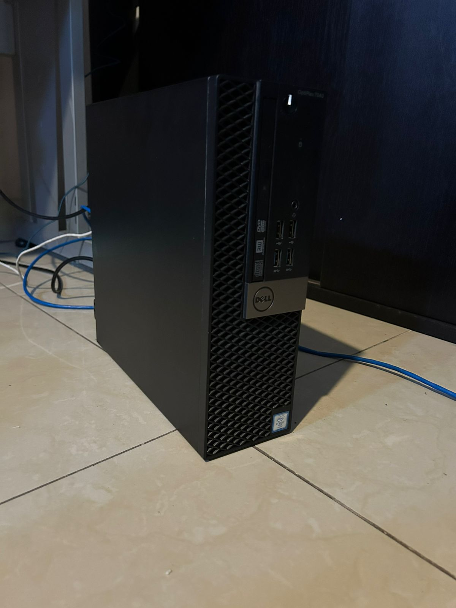

# Infraestructura Física (Hardware)

Para este entorno de laboratorio, opté por utilizar equipo de grado empresarial en formato reducido. Esta decisión técnica permite mantener un bajo consumo energético y un nivel de ruido mínimo, ofreciendo al mismo tiempo un alto rendimiento y estabilidad para operaciones de virtualización 24/7.

## Especificaciones del Servidor Base

| Componente | Detalle |
| :--- | :--- |
| **Modelo** | Dell OptiPlex 7040 |
| **Procesador (CPU)** | Intel Core i7-6700 @ 3.40GHz |
| **Memoria (RAM)** | 32 GB DDR4 |
| **Almacenamiento** | 1 TB SSD (Estado Sólido) |
| **Gráficos** | Intel HD Graphics 530 |
| **Interfaz de Red** | 1x Gigabit Ethernet (RJ45) |

