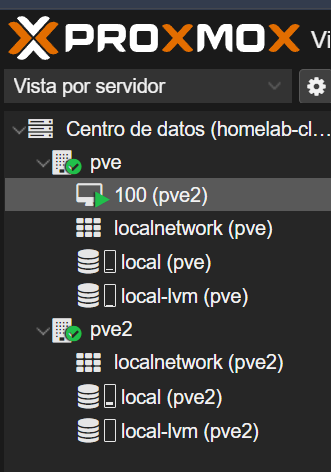

# Clúster y Alta Disponibilidad (Nested Virtualization)

Para aprender a configurar clústeres, administrar múltiples servidores dentro de una sola interfaz y simular un entorno de Alta Disponibilidad (HA) sin requerir hardware adicional, se configuró un segundo nodo utilizando Virtualización Anidada (*Nested Virtualization*).

## 1. Implementación del Nodo Virtualizado (`pve2`)

Se desplegó una máquina virtual dentro del nodo físico principal (`pve`) con las siguientes especificaciones:

* **Parámetros de la Máquina Virtual (VM 100):**
  * **Almacenamiento:** 64 GB
  * **Memoria RAM:** 4096 MB (4 GB)
  * **CPU:** 3 Cores. 
  * **Configuración crítica:** El tipo de CPU se ajustó a `host` para habilitar el passthrough de las instrucciones de virtualización de hardware (Intel VT-x) al sistema operativo huésped. Sin este ajuste, el nodo virtual no podría ejecutar sus propias máquinas virtuales.
  * **Red:** Modelo VirtIO sobre el bridge `vmbr0`.

* **Configuración de Red (Estática - Nodo 2):**
  * IP / CIDR: `192.168.1.201/24`
  * Gateway: `192.168.1.1`

## 2. Configuración del Clúster (Corosync)

Una vez que el segundo nodo estuvo en línea, se centralizó la administración uniendo ambos nodos bajo un mismo Datacenter lógico:

1. Se creó el clúster (ej. `homelab-cluster`) desde el nodo principal físico (`pve`).
2. Se extrajo la huella criptográfica (*Join Information*).
3. Se integró el nodo virtual (`pve2`) validando los certificados y estableciendo una comunicación bidireccional exitosa.

## Estado Actual del Clúster
El clúster está en línea, saludable, y listo para el despliegue de servicios (Contenedores LXC, servidores DHCP/DNS, VPNs) y la futura configuración de almacenamiento compartido o reglas de Alta Disponibilidad.

> 